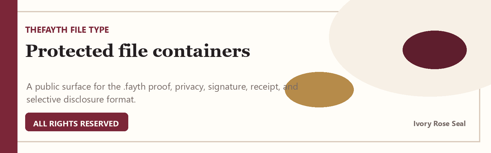
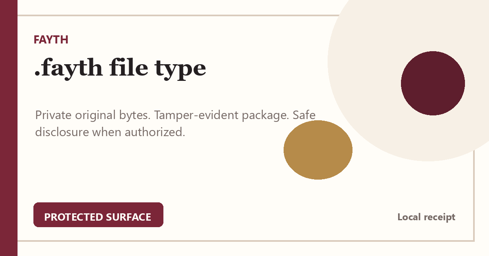
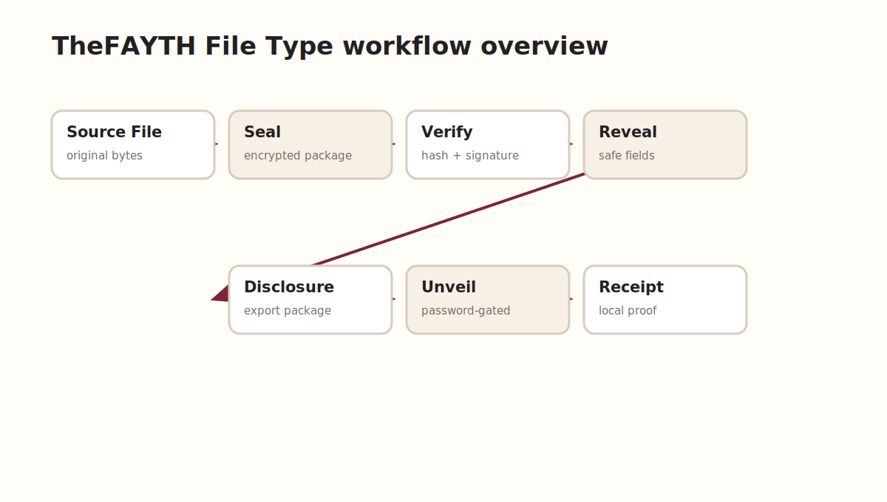
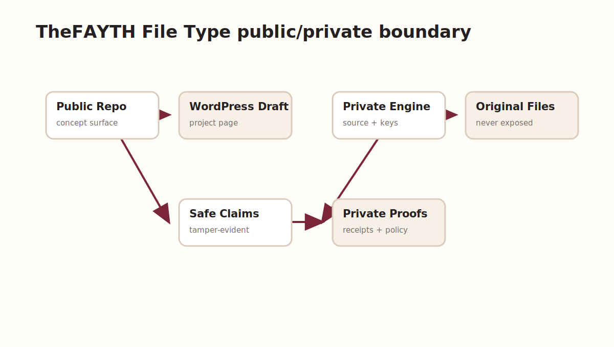
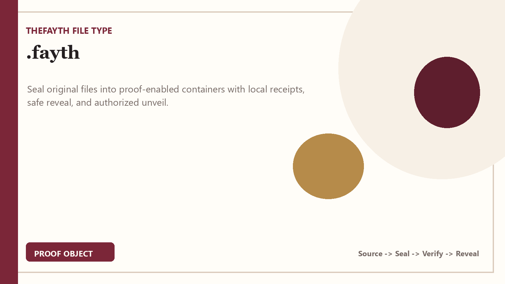

# TheFAYTH File Type

A protected public surface for the .fayth proof, privacy, receipt, and selective disclosure container.

This repository is a protected public project surface. It is not the full source code, operational system, private workflow, or data room.

## What Is This?

TheFAYTH File Type is a protected public project surface for a private Faith-built system. It explains the product purpose, current status, ownership posture, and public-safe workflow without publishing the engine itself.

## Why It Matters

TheFAYTH File Type protects original bytes, preserves provenance, supports safe inspection, and makes AI-readable disclosure more intentional.

## Who It Is For

Creators, technologists, collaborators, and partners who need to understand the .fayth container concept without receiving the implementation or private proof workflows.

## How It Works

A source file is sealed into an encrypted .fayth package with metadata, hashes, signatures, a local receipt, safe reveal fields, and password-gated unveil.

## Visual Gallery

## What Is Public Here

- Format overview, careful security language, workflow diagrams, and WordPress page draft.
- Ivory Rose Seal brand visuals, project icon, social preview, and disclosure-safe visual package.
- Commercial-use policy, privacy review, and public/private boundary documentation.

## What Remains Private

- Implementation source, local signing keys, test payloads, private proof records, passwords, and unpublished patent/product notes.
- Adult-only .fay package work, private disclosure policies, and sensitive original files.
- Any legal, medical, benefits, family, or administrative records.

## Current Status

Prepared public surface. The v1 file implementation remains private and local-first pending review.

## Work With Faith

Faith offers quote-first protected-file/provenance consulting, GitHub/public surface packaging, local AI workflow setup, AI brand system audits, and website visual cleanup.

- Request a scoped project: [FaithCheltenham.com/contact](https://faithcheltenham.com/contact/)
- Project page: [TheFAYTH File Type](https://faithcheltenham.com/projects/thefayth-file-type/)
- Portfolio and offers: [Faith AI Systems Portfolio](https://thefayth.github.io/faith-ai-systems-portfolio/)
- Pilot sprint menu: [Pilot Sprint Menu](https://thefayth.github.io/faith-ai-systems-portfolio/pilot-sprint-menu.html)
- Public proof index: [Public Proof Index](https://thefayth.github.io/faith-ai-systems-portfolio/public-proof-index.html)
- Referral and introduction kit: [Referral And Introduction Kit](https://thefayth.github.io/faith-ai-systems-portfolio/referral-introduction-kit.html)
- Request scope guide: [Request Scope](https://thefayth.github.io/faith-ai-systems-portfolio/scope-request.html)
- Investor or partner brief: [Investor And Partner Brief](https://thefayth.github.io/faith-ai-systems-portfolio/investor-partner-brief.html)
- Work with Faith details: [WORK_WITH_FAITH.md](WORK_WITH_FAITH.md)
- Commercial offers: [docs/COMMERCIAL_OFFERS.md](docs/COMMERCIAL_OFFERS.md)
- Ask about licensing or partnership: [FaithCheltenham.com/contact](https://faithcheltenham.com/contact/)

## How To Learn More

- Review the public docs in `docs/`.
- Read the WordPress draft in `wordpress/page.md`.
- Public project path recommendation: `/projects/thefayth-file-type/`
- Intended GitHub repository: [thefayth/thefayth-file-type](https://github.com/thefayth/thefayth-file-type)

## Ownership

Copyright (c) 2026 XXYYZZ Society LLC and Faith Cheltenham. All rights reserved.

No public license, source release, redistribution permission, training permission, commercial-use permission, or implied permission is granted.
